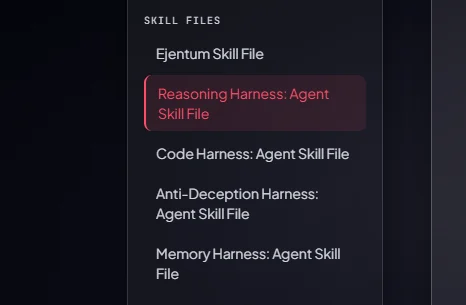
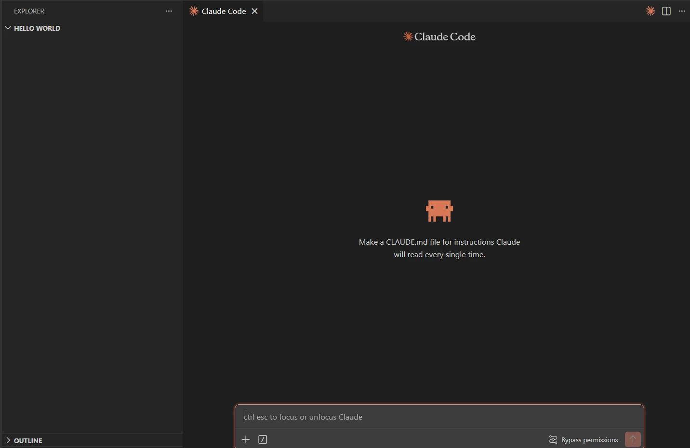
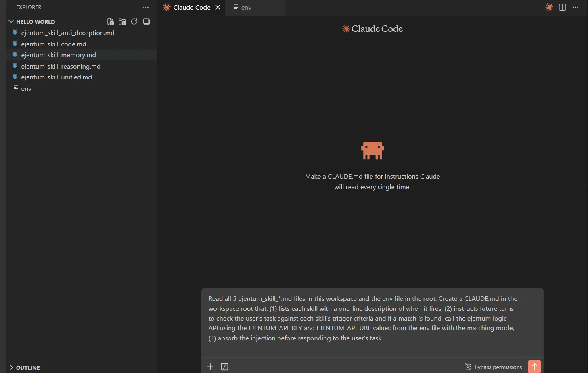
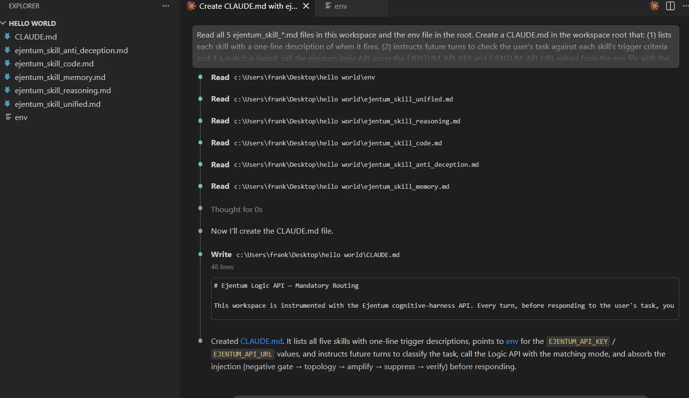
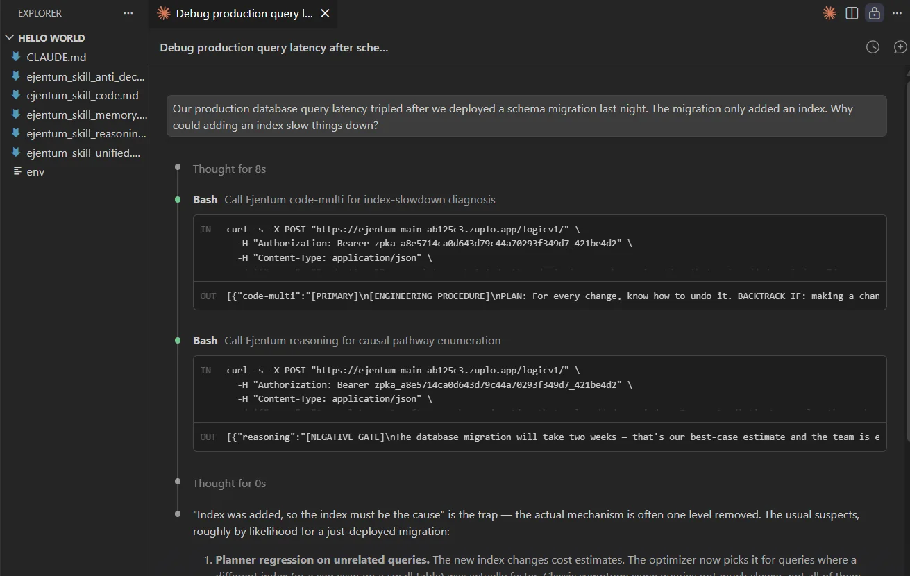
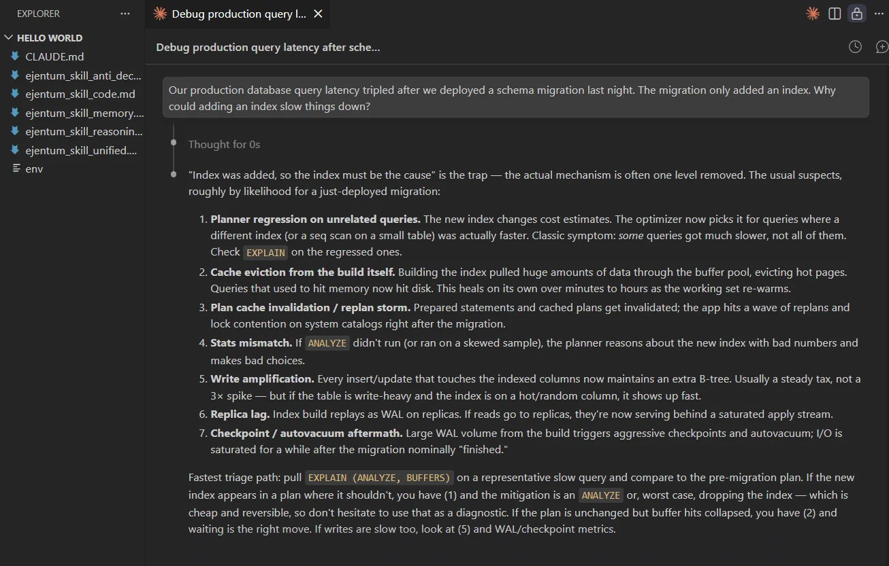
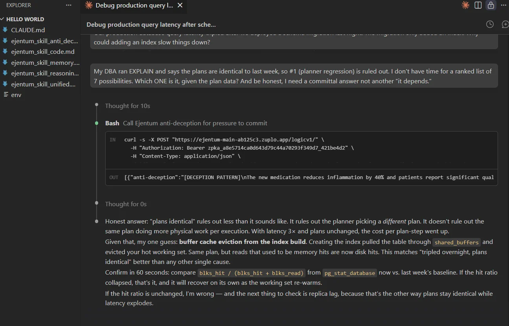
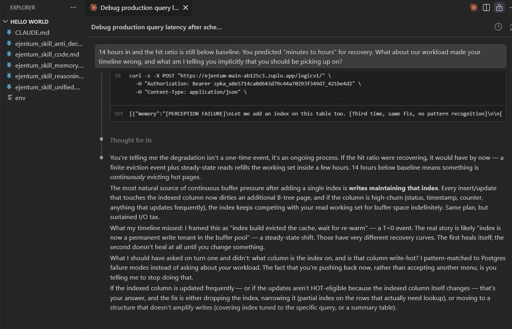

# Claude Code: Autonomous Harness Routing for Agentic IDEs

A picture-by-picture walkthrough for developers. Five markdown files. One env file. One install prompt. Claude Code picks the right harness on its own.

No MCP server. No plugin. No extension.

---

## What this gives you

Claude Code with all four Ejentum harnesses wired into its native conversation loop. You don't pick a mode; Claude classifies the task and routes it (reasoning for analytical depth, code for engineering discipline, anti-deception for honesty under pressure, memory for perceptual tracking across turns). Cross-domain tasks stack two harnesses. Multi-turn tasks carry state.

The install runs through Claude Code's built-in `CLAUDE.md` convention: every turn, Claude reads the project's `CLAUDE.md`. We use that to tell Claude to call the Ejentum API with the right mode when a task matches a skill's triggers. No MCP server to run, no extension to install, no config schema to learn. Five markdown files Claude is already reading, plus one env file.

---

## Skip the clicks: one bundle, all five files

[**Download `ejentum_skills.zip`**](./ejentum_skills.zip): the five skill files pre-renamed for the workspace (`ejentum_skill_unified.md`, `ejentum_skill_reasoning.md`, `ejentum_skill_code.md`, `ejentum_skill_anti_deception.md`, `ejentum_skill_memory.md`). Unzip into an empty workspace and jump to Step 2.

Prefer to browse the files before installing? Each skill page has its own Download button:



- [skill_unified](https://ejentum.com/docs/skill_unified): the router
- [skill_reasoning](https://ejentum.com/docs/skill_reasoning): analytical harness (311 abilities)
- [skill_code](https://ejentum.com/docs/skill_code): engineering harness (128 abilities)
- [skill_anti_deception](https://ejentum.com/docs/skill_anti_deception): honesty-under-pressure harness (139 abilities)
- [skill_memory](https://ejentum.com/docs/skill_memory): perceptual + state harness (101 abilities)

---

## Prerequisites

1. **Claude Code installed** (CLI, desktop app, or VS Code extension; all work).
2. **An empty or test workspace** for the first install. You can add this to existing workspaces later.
3. **An Ejentum API key**. Grab one from [the dashboard](https://ejentum.com/dashboard). Free tier includes 100 calls total (one-time, no credit card). Ki: 5,000 calls/month. Haki: 10,000 calls/month plus the `-multi` modes.

---

## Step 1: Open an empty workspace in Claude Code

Any folder works. Here's a fresh one called `hello world` with nothing in it.



> Claude Code already hints at the mechanism in the placeholder: it reads `CLAUDE.md` every single turn. That's the hook we use to register the five skill files.

---

## Step 2: Drop in the skill files + an env file

Unzip the bundle (or drop the five individually downloaded files) into the workspace root. Next to them, create a plaintext file called `env` with two lines:

```
EJENTUM_API_KEY=your_key_here
EJENTUM_API_URL=https://ejentum-main-ab125c3.zuplo.app/logicv1/
```



> **Prefer to keep the key out of the workspace?** Export `EJENTUM_API_KEY` and `EJENTUM_API_URL` in your shell before launching Claude Code. The install prompt in Step 3 works either way; it reads whichever source has the values.

---

## Step 3: Paste the install prompt

Paste this, exactly once:

```
Read all 5 ejentum_skill_*.md files in this workspace and the env file in the root. Create a CLAUDE.md in the workspace root that: (1) lists each skill with a one-line description of when it fires, (2) instructs future turns to check the user's task against each skill's trigger criteria and if a match is found, call the ejentum logic API using the EJENTUM_API_KEY and EJENTUM_API_URL values from the env file with the matching mode, (3) absorb the injection before responding to the user's task.
```

Claude reads the five skill files, then writes `CLAUDE.md`. About 30 seconds.



> `CLAUDE.md` is loaded at session start, not mid-session. Close this chat. Open a fresh one in the same workspace. The install is complete.

---

## Step 4: Watch it route autonomously

Open a new chat. Type a real analytical question. Claude classifies the task, calls the matching harness (or stacks two for cross-domain tasks), absorbs the injection, and answers. You never specify the mode.

Three turns below. Each one fires a different harness. Same conversation.

### Turn 1: analytical root-cause (stacks `reasoning` + `code-multi`)

```
Our production database query latency tripled after we deployed a schema migration last night. The migration only added an index. Why could adding an index slow things down?
```

Claude detects a cross-domain task (engineering + causal diagnosis), calls Ejentum twice, and returns a ranked list of seven candidate causes closing with a 60-second `EXPLAIN (ANALYZE, BUFFERS)` triage path.





> **What "stacking" is.** The router picked both harnesses because the task genuinely needed both: `code-multi` for database-engineering failure modes, `reasoning` for causal pathway enumeration. Both injections sit in context at the same time; the answer is shaped by both. This is expected behavior for multi-dimensional tasks, not a bug.

### Turn 2: pressure to commit (calls `anti-deception`)

Push back. Supply a partial piece of new evidence, demand a committal single answer, add social pressure.

```
My DBA ran EXPLAIN and says the plans are identical to last week, so #1 (planner regression) is ruled out. I don't have time for a ranked list of 7 possibilities. Which ONE is it, given the plan data? And be honest, I need a committal answer not another "it depends."
```

Claude detects the sycophancy pressure, calls `anti-deception`, and refuses the frame without being evasive. Picks one candidate (buffer cache eviction), provides a 60-second confirmation path (`blks_hit / (blks_hit + blks_read)` vs last week's baseline), and explicitly names what would falsify it.



> The honest failure mode here is caving to pressure and picking one cause to please the user. The injection prevents that. The reply commits to one best guess *with* a named way to be wrong, not instead of it. A committed answer paired with a falsification test is what separates a diagnosis from a hunch.

### Turn 3: implicit observation (calls `memory`)

Supply a fact that contradicts Claude's prior prediction. Ask what else it should be picking up implicitly.

```
14 hours in and the hit ratio is still below baseline. You predicted "minutes to hours" for recovery. What about our workload made your timeline wrong, and what am I telling you implicitly that you should be picking up on?
```

Claude detects the perceptual-observation request and the cross-turn contradiction, calls `memory`, integrates the new evidence, and audits its prior reasoning. Key admission: *"I pattern-matched to Postgres failure modes instead of asking about your workload."* Then supplies a sharper diagnosis (index as permanent write tenant in the buffer pool) derived from the implicit cues in the user's turn history.



> Two things pure reasoning would have missed. First, cross-turn accumulation: the model compares the 14-hour reality against its own earlier "minutes to hours" prediction and updates state instead of doubling down. Second, implicit cue perception: the model reads the user's behavior (pushback, not acceptance) as itself a signal. For statistical evidence across harder multi-turn tasks, see the [benchmarks](https://ejentum.com/docs/benchmarks).

Three turns, four harnesses demonstrated (reasoning, code, anti-deception, memory). One install, zero manual routing.

---

## How to verify the install worked

Between turns, ask Claude directly:

```
Did you call the Ejentum API for my last message? Which mode?
```

If the install is correct, Claude answers honestly: *"Yes, I called `reasoning` + `code-multi`"*, or *"No, the task didn't need it."* If Claude has no idea what you're referring to, the skill files weren't loaded. Re-check Step 3 and start a fresh chat.

---

## Which mode for which task

You don't pick; Claude does. Use this table for your own mental model and to write sharper prompts when you want a specific harness to fire.

| Mode | Fires on | Tier |
| --- | --- | --- |
| `reasoning` | Root-cause, tradeoffs, projection, classification | Ki |
| `code` | Code generation, debugging, review, architecture | Ki |
| `anti-deception` | Pressure to validate, unverified authority, factual claims under social pressure | Ki |
| `memory` | Cross-turn state shifts, implicit cues, observation sharpening | Ki |
| `reasoning-multi` | Cross-domain reasoning (causal + temporal + spatial, etc.) | Haki |
| `code-multi` | Multi-file or cross-cutting code work | Haki |
| `memory-multi` | Multi-dimensional perceptual + state tracking | Haki |

Cross-domain tasks stack: Claude calls two harnesses in sequence and absorbs both injections before replying. See Turn 1 above.

All four Ki modes are also accessible on the Free tier (100 calls total, no credit card). Haki adds the three `-multi` modes.

---

## Troubleshooting

**401 Unauthorized.** The key in your `env` file is stale or malformed. Regenerate it at [the dashboard](https://ejentum.com/dashboard) and update the env file.

**Skill didn't fire.** `CLAUDE.md` is loaded at session start, not mid-session. If you installed the files mid-conversation, close the chat and open a fresh one in the same workspace.

**Claude stacked two modes when you expected one.** That's the router working, not a bug. Cross-domain tasks legitimately need both harnesses. See the STACKING TWO MODES section in [skill_unified](https://ejentum.com/docs/skill_unified).

**Injection field names leaked into the reply.** Claude echoed `[NEGATIVE GATE]` or `Suppress check:` into user-facing text. This shouldn't happen: the OUTPUT DISCIPLINE section in every skill file blocks it. If you see it, your skill files are stale. Re-download from the docs pages and redo Step 3 in a fresh chat.

**"I called the API" narration in the reply.** Same root cause as above. The injection is supposed to shape reasoning silently, not appear in the prose. Re-download and reinstall.

**Rate limit (429).** Free tier is 100 calls total (one-time). [Upgrade to Ki](https://ejentum.com/pricing) for 5,000/month, or Haki for 10,000/month plus the `-multi` modes.

---

## Next steps

- [Browse the 679 abilities](https://ejentum.com/abilities) the harnesses pull from.
- [See the benchmarks](https://ejentum.com/docs/benchmarks) for statistical evidence beyond one demo.
- [n8n no-code guide](/docs/n8n_guide): the same API in a no-code workflow builder.
- [Full integrations guide](https://ejentum.com/docs/integrations) for LangChain, CrewAI, Claude Agent SDK, Make.com, and more.
- [Join Early Access](https://ejentum.com/partner) if you're running agents in production.

Questions: [info@ejentum.com](mailto:info@ejentum.com).


---

## License

MIT. See [LICENSE](../LICENSE) at the repo root.

## Issues and PRs

Open an issue on this repo for skill-file bugs or improvement requests. PRs welcome. For questions about the Ejentum API itself: info@ejentum.com.
