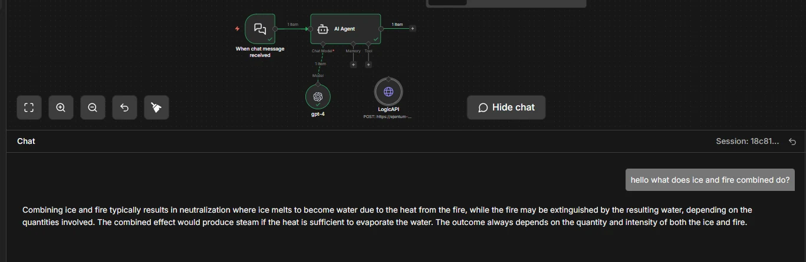
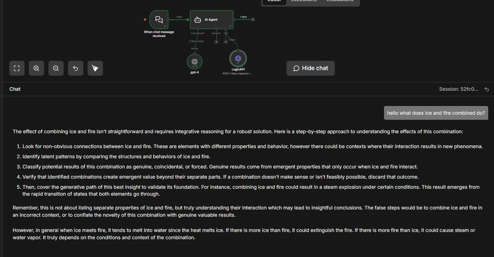
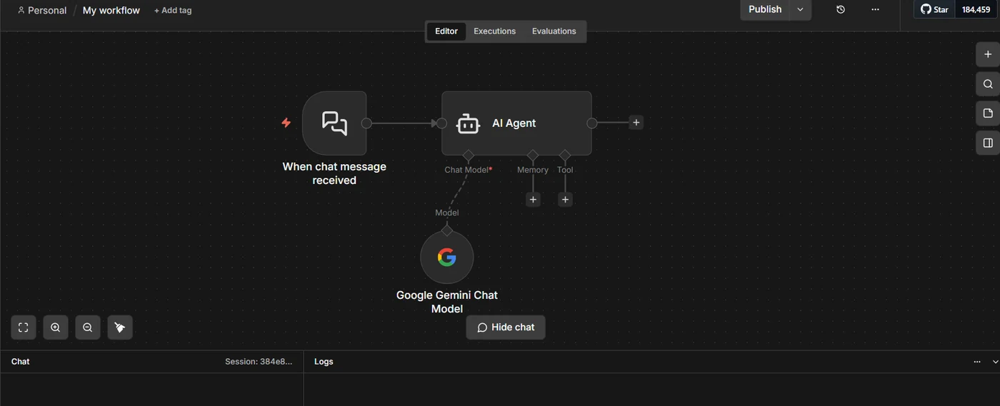
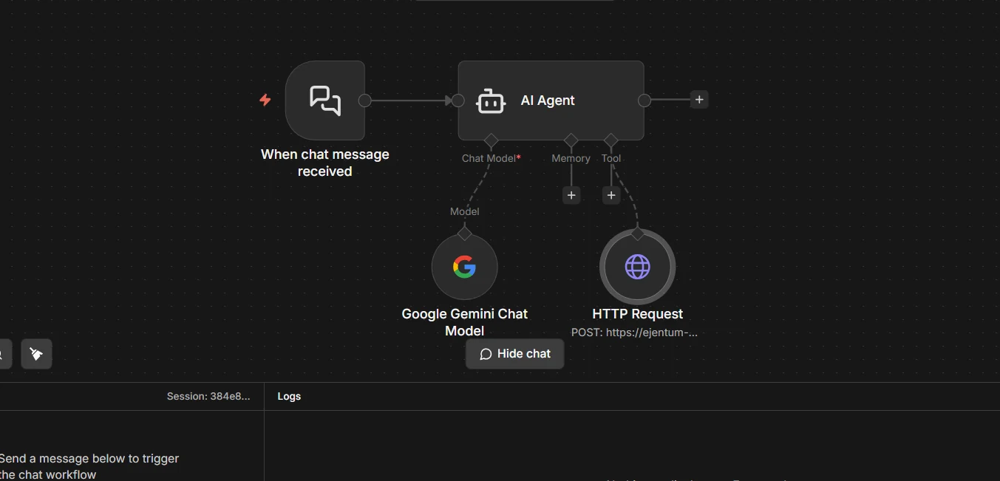
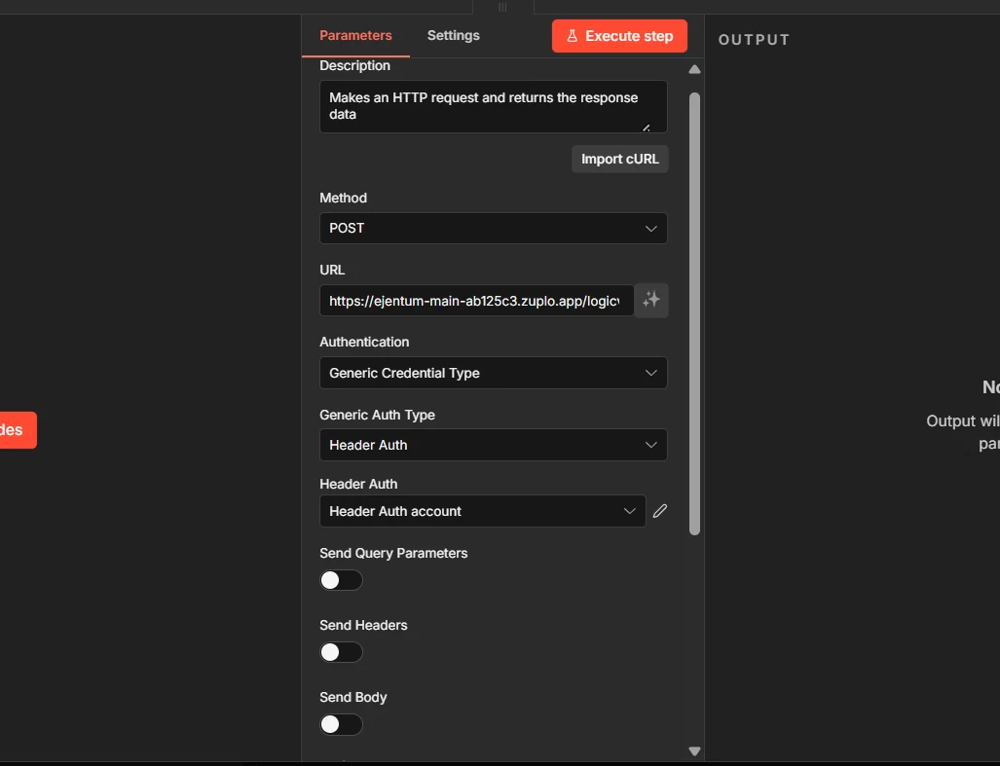
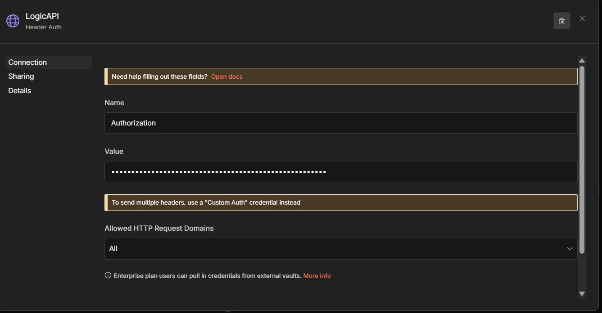
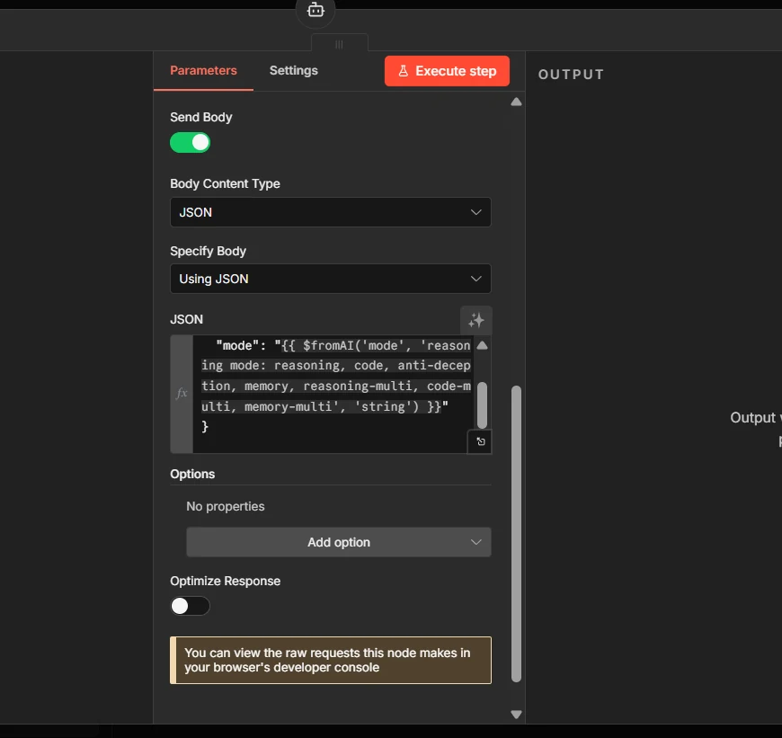
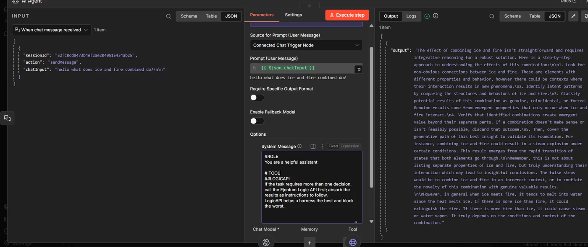
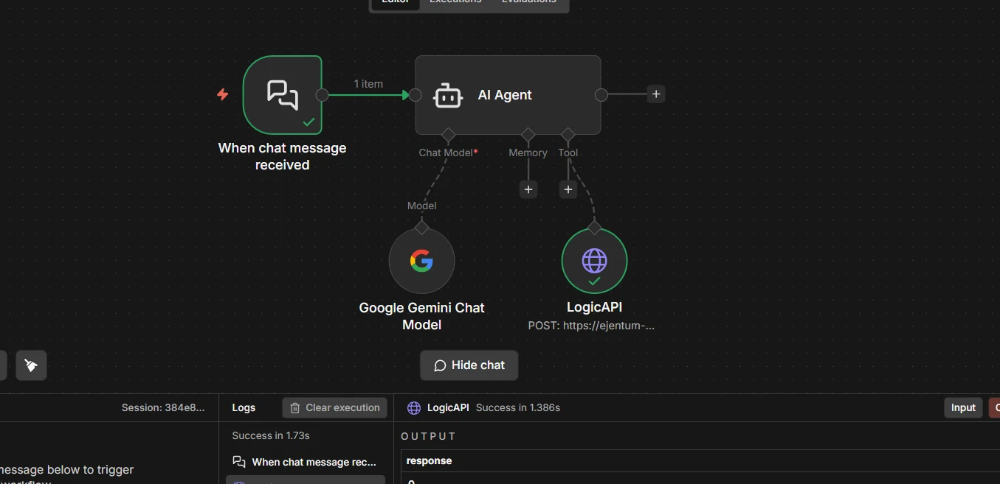
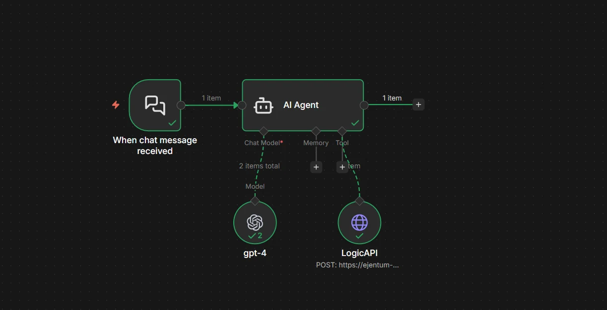

# n8n: Drop Ejentum Into Any AI Agent

A picture-by-picture walkthrough for no-code builders. One HTTP Request tool, one credential, two sentences in the system message.

No Python. No SDK. No prompt rewrites.

> **Live docs:** [ejentum.com/docs/n8n_guide](https://ejentum.com/docs/n8n_guide) — same content with site navigation and one-click downloads. This repo is the source of truth; the website mirrors it.

---

## What changes when Ejentum is in the loop

Same agent. Same model. Same question: *"hello what does ice and fire combined do?"* Once without Ejentum, once with.

**Without Ejentum.** The baseline agent answers at face value.



One paragraph. "Melts into water, could extinguish fire, depending on conditions." Reasonable. Not structured.

**With Ejentum.** The same agent now follows a reasoning procedure.



Five explicit steps. Looks for non-obvious connections. Classifies outcomes as genuine, coincidental, or forced. Verifies that combinations create emergent value. Then delivers a grounded conclusion.

The agent didn't change. Its reasoning procedure did. The tool returns a scaffold; the agent injects it before answering. Same model, same prompt, stricter reasoning.

> One example, chosen for clarity. For statistical evidence across harder tasks, see the [benchmarks](https://ejentum.com/docs/benchmarks).

---

## Skip the clicks: import a ready-made workflow

Two downloads. Pick one.

### Option A: Just the tool node (recommended)

[**Download `logic_api_http.json`**](./logic_api_http.json): the HTTP Request tool by itself. Import it into any existing workflow; drag the LogicAPI node under your AI Agent's **Tool** socket; add your credential (Step 4 below). Done.

### Option B: Full starter workflow

[**Download `logic_api_agent_workflow.json`**](./logic_api_agent_workflow.json): chat trigger + AI Agent + chat model + LogicAPI tool, pre-wired with the recommended system message and tool description. Import it, set two credentials (your chat model, your Ejentum key), and you're live.

> **On import:** n8n will prompt you to bind a chat model credential (OpenAI by default; swap to Claude or Gemini by replacing the Chat Model node) and an Ejentum Header Auth credential. That's the entire setup.

Prefer to build it yourself? Keep reading.

---

## Prerequisites

1. An **n8n instance** (cloud or self-hosted, 1.60+ for AI Agent support).
2. An **existing AI Agent workflow**, or a new one with any chat model (OpenAI, Claude, Gemini all work).
3. An **Ejentum API key**. Grab one from [the dashboard](https://ejentum.com/dashboard). Free tier includes 100 calls total (one-time, no credit card). Ki: 5,000 calls/month. Haki: 10,000 calls/month + the `-multi` modes.

> Getting the key: sign in, open the **Account** tab, click **Generate Key** under API Keys. Copy the full key (starts with `zpka_...`). You'll paste it in Step 4.

---

## Step 1: Open your AI Agent workflow

Start from any workflow with an AI Agent node. The **Tool** socket under the agent is empty. That's what you're about to fill.



> **Now click:** the **+** under the agent's **Tool** socket, and choose **HTTP Request** (the one with the tool icon, internally `toolHttpRequest`). Not the general-purpose HTTP Request node. Click that, and you land in Step 2.

---

## Step 2: HTTP Request tool is now attached

A new HTTP Request node hangs off the Tool socket. This is what your click in Step 1 produced. Click the new node to open its configuration panel.



---

## Step 3: Configure the node

Fill these four fields exactly:

- **Method:** `POST`
- **URL:** `https://ejentum-main-ab125c3.zuplo.app/logicv1/`
- **Authentication:** `Generic Credential Type`
- **Generic Auth Type:** `Header Auth`



> **Next click:** the **Header Auth account** dropdown. The next step creates a new credential. Leave **Send Body** off for now; we come back to it in Step 5.

---

## Step 4: Create a credential for your API key

In the credential dialog, fill:

- **Name:** `Authorization`
- **Value:** `Bearer YOUR_KEY` (paste your real Ejentum key where it says `YOUR_KEY`; keep the word `Bearer` and one space)



> Grab your key from [ejentum.com/dashboard](https://ejentum.com/dashboard), **Account** tab, **Generate Key**.

Save. The credential auto-selects in the node and is reusable by any future workflow that calls Ejentum.

---

## Step 5a: Turn on Send Body and paste the JSON

Scroll down. Toggle **Send Body** **ON**. Set **Body Content Type** to `JSON`. Set **Specify Body** to `Using JSON`. Paste:

```json
{
  "query": "{{ $fromAI('query', 'short description of the task') }}",
  "mode": "{{ $fromAI('mode', 'reasoning mode: reasoning, code, anti-deception, memory, reasoning-multi, code-multi, memory-multi', 'string') }}"
}
```



> **Why `$fromAI()`:** it lets the AI Agent fill in `query` and `mode` on its own, per call. The agent decides what to ask about and which cognitive mode fits the task.

---

## Step 5b: Paste the Description at the top of the node

Scroll back up to the **Description** field. This is the most important field in the whole setup: it tells the agent **when** to call the tool and **which modes exist**. Without it, the agent either never calls Ejentum or picks the wrong mode.

```
Call this before executing any non-trivial task. Pass a short task description and the mode that matches the work. Returns a structured reasoning injection with [NEGATIVE GATE] (failure pattern to avoid), [PROCEDURE] (step-by-step reasoning), [REASONING TOPOLOGY] (execution DAG), and [FALSIFICATION TEST] (verification). Inject the returned text into your own reasoning context BEFORE executing the task. Modes: 'reasoning' (general analytical tasks, default), 'code' (code generation or refactoring), 'anti-deception' (blocks sycophancy, hallucination, prompt injection), 'memory' (perception and state tracking), 'reasoning-multi' (complex cross-domain tasks, Haki tier), 'code-multi' (Haki tier), 'memory-multi' (Haki tier).
```

> **Two layers of instruction, don't confuse them.** The **Description** (here, on the tool node) tells the agent *what the tool does and when to use it*. The **System Message** (on the AI Agent node, Step 6) tells the agent *how to treat what it gets back*. Both must be set; one without the other doesn't work.

---

## Step 6: Tell the agent to use the tool

Open the **AI Agent** node. Scroll to **System Message**. Paste:

```
# TOOL
## LOGICAPI
If the task requires more than one decision, call the Ejentum Logic API first; absorb the results as instructions to follow.
LogicAPI helps u harness the best and block the worst.
```



> Short and direct. Plants one habit: if the task takes more than one decision, call Ejentum first and follow what comes back. The tool description from Step 5b fills in the rest (modes, response shape, verification).

With both layers set, the wiring is complete. Now test it.

---

## Step 7: Test the tool in isolation

Before running the whole agent, verify the tool works on its own. Click the Ejentum tool node, then **Execute step** in the top right of the panel.



> If the response contains `[NEGATIVE GATE]`, `[PROCEDURE]`, and `[REASONING TOPOLOGY]`, the tool is wired correctly. If you see a 401, re-check your credential (value must be `Bearer YOUR_KEY`, capitalized `Bearer`, one space). If you see "Invalid mode", the JSON body differs from Step 5a.

### What the response looks like when it works

Every response is a pre-rendered string you can drop straight into the agent's context. Five fields, always in this shape:

- **`[NEGATIVE GATE]`**: the failure pattern to avoid (what bad reasoning looks like on this task).
- **`[PROCEDURE]`**: the step-by-step reasoning procedure to follow.
- **`[REASONING TOPOLOGY]`**: the execution DAG (nodes, gates, loops) rendered inline.
- **`[TARGET PATTERN]`**: what correct reasoning looks like in plain language.
- **`[FALSIFICATION TEST]`**: the check that tells you if reasoning has failed.
- **`Amplify:`** and **`Suppress:`**: signals to activate; failure modes to block.

You don't assemble these fields. The API returns the string already formatted. The agent reads it and reasons from it.

---

## Step 8: Run the full workflow

Send a test message to your chat trigger. The agent decides whether to call Ejentum, fills in `query` and `mode` on its own, receives the injection, and reasons from it.


> A green check on the LogicAPI node means the agent read your system message, decided the task was non-trivial, and pulled a scaffold. Read the chat output: the reasoning should now look structured in the same way Step 7 returned it.

---

## Final workflow

Your final wiring, clean. One tool. One credential. Two sentences in the system message.



---

## Which mode for which task

You don't pick manually; the agent picks via `$fromAI('mode', ...)`. This table is for the **tool description** writing and for your own mental model.

| Mode | Use it when | Tier |
| --- | --- | --- |
| `reasoning` | General analytical tasks (default) | Ki |
| `code` | Code generation, refactoring, architecture | Ki |
| `anti-deception` | Blocking sycophancy, hallucination, prompt injection | Ki |
| `memory` | Perception, state tracking, behavioral calibration | Ki |
| `reasoning-multi` | Complex cross-domain reasoning | Haki |
| `code-multi` | Multi-file or multi-domain code work | Haki |
| `memory-multi` | Deep perceptual + stateful reasoning | Haki |

All four Ki modes are also accessible on the Free tier (100 calls total, no credit card). Haki adds the three `-multi` modes.

If in doubt, the agent picks `reasoning`. That's the right default for roughly 80% of tasks.

---

## Three concrete builds

Not abstract use cases. Three real workflows you can wire this afternoon.

**1. Research agent that cites its own reasoning.** Chat trigger > AI Agent with two tools: a web search tool and the Ejentum tool. System message: "For analytical tasks, call Ejentum with `reasoning-multi`. For any final conclusion, call Ejentum with `anti-deception` to check for hallucinated citations before responding."

**2. Customer-reply agent that refuses to agree when it shouldn't.** Chat trigger > AI Agent with the Ejentum tool. System message: "Before every reply, call Ejentum with `anti-deception`. If `[Suppress:]` includes sycophancy and the draft contains unconditional agreement, rewrite."

**3. Code-review agent that flags its own hand-waving.** Code diff input > AI Agent with the Ejentum tool. System message: "Call Ejentum with `code` before reviewing. If you catch yourself writing 'looks fine' without enumerating concrete checks, call `anti-deception` and rewrite with specific counts and named failure modes."

Each of these is one tool, one system message, no branching. Copy the pattern.

---

## Troubleshooting

**401 Unauthorized.** The credential value must be exactly `Bearer YOUR_KEY`, with `Bearer` capitalized and one space before the key. Re-create the credential if in doubt.

**"Invalid mode".** The JSON body sent a mode the API doesn't recognize. Only the seven modes in the tool description are valid.

**Tool never fires.** The agent decided every task was too trivial. Fixes, in order: (a) make the task harder; (b) tighten the system message ("call Ejentum *for every task*, no exceptions"); (c) rewrite the tool description to lower the "non-trivial" threshold.

**Tool fires every single time.** Opposite problem: system message is too aggressive. Relax it ("call Ejentum when the task has more than one decision or requires planning") so the agent keeps discretion.

**Agent calls the tool but ignores the response.** The system message in Step 6 is the fix: it must explicitly say *follow the* `[PROCEDURE]` *and verify against the* `[FALSIFICATION TEST]`. Without that, the agent treats the response as optional context.

**Rate limit (429).** Free tier is 100 calls total (one-time). [Upgrade to Ki](https://ejentum.com/pricing) for 5,000 calls/month, or Haki for 10,000 calls/month plus the `-multi` modes.

---

## Next steps

- [Browse the 679 abilities](https://ejentum.com/abilities) the agent is pulling from.
- [See the benchmarks](https://ejentum.com/docs/benchmarks) for statistical evidence, not one-example demos.
- [Read the full integrations guide](https://ejentum.com/docs/integrations) for LangChain, CrewAI, Claude Agent SDK, Make.com, and more.
- [Join Early Access](https://ejentum.com/partner) if you're running agents in production.

Questions: [info@ejentum.com](mailto:info@ejentum.com).


---

## License

MIT. See [LICENSE](../LICENSE) at the repo root.

## Issues and PRs

Open an issue on this repo for integration bugs or improvement requests. PRs welcome. For questions about the Ejentum API itself: info@ejentum.com.
